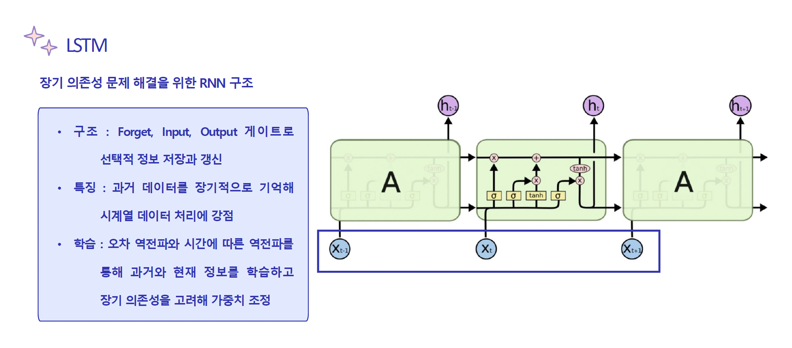

# 📈 S&P 500 주가 예측 프로젝트
### Transformer와 기존 모델(MLP,LSTM)의 주가 예측 비교
### 📌 프로젝트 개요
S&P 500 주식 데이터를 활용하여 다중 모델(MLP, LSTM, Transformer)을 비교 분석하여 주가를 예측하는 프로젝트입니다.

본 프로젝트에서는 딥러닝 기반의 주가 예측 모델을 구현 및 비교하여, 어떤 모델이 S&P 500의 주가 예측에 가장 적합한지를 탐구하였습니다.
Transformer 모델의 Self-Attention 메커니즘이 시계열 데이터 예측에서 가지는 강점을 실험적으로 검증하는 것을 목표로 하였습니다.

- 프로젝트 기간 : 2024.07 - 2024.11

- 팀 구성 :
    - 팀장 : 이지아
    - 팀원 : 1명

### 🎯 연구 배경 및 목적
최근 2030 세대의 투자 참여 증가와 증시의 높은 변동성으로 인해,
정확한 주가 예측의 중요성이 크게 부각되고 있습니다.
이와 함께 복잡한 패턴 처리와 비선형 문제 해결에 강점을 지닌 딥러닝 기술이
금융 데이터 분석 분야에서 주목받고 있습니다.

본 프로젝트는 이러한 흐름 속에서 Transformer 모델의 이해 및 활용을 중점적으로 학습하기 위해 수행되었습니다.

### 📂 모델 개요

### 📊 데이터셋
- 출처 : Kaggle 및 yfinance 라이브러리를 활용하여 [S&P 500 주가 데이터](https://www.kaggle.com/datasets/andrewmvd/sp-500-stocks)를 수집
- 특징 데이터 : Symbol, Open, High, Low, Close, Volume
- 예측 대상 : 종가(Close Price)

### 🛠 기술 스택
본 프로젝트에서는 PyTorch를 활용하여 모델을 구현하고 학습을 진행하였습니다.
- 프레임워크 : PyTorch
- 라이브러리 : NumPy, Pandas, Scikit-learn, Matplotlib
- 환경 : Python 3

### 📈 성능 평가
S&P 500 전체 약 500개 종목에 대해 예측을 수행하였으나, 분석의 초점을 맞추기 위해 AAPL, MSFT, NVDA 3개의 종목을 선정하여 결과를 비교하였습니다.

- 정량적 평가
    - RMSE : Transformer가 MSFT 및 NVDA에서 가장 좋은 성능을 보였으나, AAPL의 경우 MLP가 가장 우수한 성능을 기록
    - MDA : 모델 간 차이가 크지 않음
    
