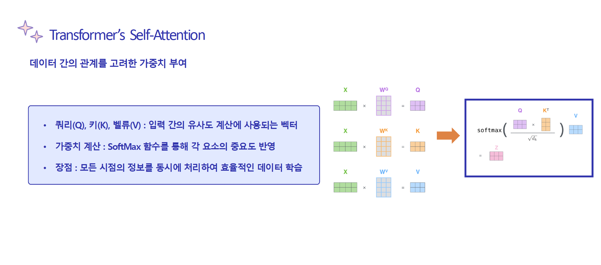
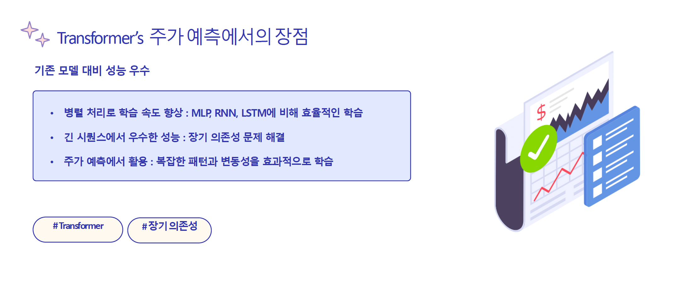

# 📈 S&P 500 주가 예측 프로젝트
### Transformer와 기존 모델(MLP,LSTM)의 주가 예측 비교
### 📌 프로젝트 개요
S&P 500 주식 데이터를 활용하여 다중 모델(MLP, LSTM, Transformer)을 비교 분석하여 주가를 예측하는 프로젝트입니다.

본 프로젝트에서는 딥러닝 기반의 주가 예측 모델을 구현 및 비교하여, 어떤 모델이 S&P 500의 주가 예측에 가장 적합한지를 탐구하였습니다.
Transformer 모델의 Self-Attention 메커니즘이 시계열 데이터 예측에서 가지는 강점을 실험적으로 검증하는 것을 목표로 하였습니다.

- 프로젝트 기간 : 2024.07 - 2024.11

- 팀 구성 :
    - 팀장 : 이지아
    - 팀원 : 1명

### 🎯 연구 배경 및 목적
최근 2030 세대의 투자 참여 증가와 증시의 높은 변동성으로 인해,
정확한 주가 예측의 중요성이 크게 부각되고 있습니다.
이와 함께 복잡한 패턴 처리와 비선형 문제 해결에 강점을 지닌 딥러닝 기술이
금융 데이터 분석 분야에서 주목받고 있습니다.

본 프로젝트는 이러한 흐름 속에서 Transformer 모델의 이해 및 활용을 중점적으로 학습하기 위해 수행되었습니다.

따라서 본 연구의 목적은
시계열 예측에 있어 Transformer가 기존 모델(MPL, LSTM) 대비 어떤 이점을 가지는지를
실험적으로 분석하고, 주가 예측 모델로서의 적용 가능성을 검증하는 것입니다.

### 📊 데이터셋
- 출처 : Kaggle 및 yfinance 라이브러리를 활용하여 [S&P 500 주가 데이터](https://www.kaggle.com/datasets/andrewmvd/sp-500-stocks) 수집
- 수집 기간 : 2018.01.02 - 2023.12.29
- 데이터 규모 : 744,175행 x 6열 (약 74만 개 샘플)

- 데이터 설정 : 과거 **10일치 데이터를 기반으로 예측 입력 설정**
- 데이터 구성
  

### 🛠 기술 스택
본 프로젝트에서는 PyTorch를 활용하여 모델을 구현하고 학습을 진행하였습니다.
- 프레임워크 : PyTorch
- 라이브러리 : NumPy, Pandas, Scikit-learn, Matplotlib
- 환경 : Python 3

### ⚙️ 학습 설정 (Training Configuration)

- **Loss Function** : `MSELoss()`
- **Optimizer** : `Adam`
- **Learning Rate** : `0.01`
- **Mini-batch Size** : `128`
- **Epochs** : `50`
- **공통 설정** : 모든 모델(MLP, LSTM, Transformer)에 동일한 하이퍼파라미터 적용

### 🔎 성능 평가
S&P 500 전체 약 500개 종목을 대상으로 모델을 학습하였으며,
분석의 초점을 맞추기 위해 AAPL, MSFT, NVDA 3개의 종목을 선정하여 결과를 비교하였습니다.

- 정량적 평가
  - RMSE (Root Mean Squared Error)
    - Transformer가 MSFT 및 NVDA에서 가장 우수한 성능을 보임
    - AAPL의 경우 MLP가 더 낮은 RMSE를 기록
  - MDA (Mean Directional Accuracy)
    - 세 모델 간 차이가 크지 않으며, 방향성 예측에서는 유사한 성능
- 정성적 평가 
  - LSTM은 장기 예측에서 변동성을 완화하는 안정적 추세를 보여줌
  - Transformer는 고변동 구간(NVDA) 에서 급등락을 비교적 잘 포착함
  - MLP는 소규모 데이터셋에서는 오히려 과적합 없이 안정적 예측 가능

### ✅ 결론
- transformer 모델은 복잡한 변동성이 높은 주식(NVDA, MSFT)에서 상대적으로 우수한 예측력을 보였습니다.
- MLP는 패턴이 단순한 종목(AAPL) 에서 효율적이었습니다.
- MDA 값의 차이가 미미하여, 방향성 예측에는 모델 간 큰 우열이 없음을 확인하였습니다.

### 📒 한계점 및 개선 방안
- 한계점
  - 데이터셋 규모가 상대적으로 작아, Transformer의 잠재력을 충분히 발휘하지 못했습니다.
  - 외부 요인(거시경제 지표, 뉴스, 금리 등)을 고려하지 않아 실제 시장 반응 반영에 한계가 있었습니다.

- 개선 방안
  - 데이터셋을 대규모로 확장하여 학습 안정성을 확보할 필요가 있습니다.
  - Transformer의 하이퍼파라미터 튜닝 및 구조를 최적화 (Multi-head 수, Layer 수 등) 합니다.
  - 경제 지표, 뉴스 감성 분석 결과 등 외부 요인을 통합합니다.

### 💡 주가 예측의 실용적 활용

### 📚 참고 문헌

1. 파이낸셜뉴스, “주식⦁코인 대박 꿈꾸는 2030... 투자중독 4년새 3배 급증,” *고물가⦁고금리 시대의 그늘(4)*, 2023. [Online]. Available: [https://www.fnnews.com/news/202311151807085435](https://www.fnnews.com/news/202311151807085435)

2. 김기준, “뉴스 감성 분석과 시계열 예측 기반의 주가 등락 예측,” 석사학위 논문, 숭실대학교 대학원, 2017.

3. 신동하, 최광호, 김창복, “RNN과 LSTM을 이용한 주가 예측율 향상을 위한 딥러닝 모델,” *한국정보기술학회*, 2017.

4. J. Brownlee, “When to Use MLP, CNN, and RNN Neural Networks,” *Machine Learning Mastery*, Oct. 5, 2018. [Online]. Available: [https://machinelearningmastery.com/when-to-use-mlp-cnn-and-rnn-neural-networks/](https://machinelearningmastery.com/when-to-use-mlp-cnn-and-rnn-neural-networks/)

5. 주재걸, *딥러닝* [PowerPoint 프레젠테이션], KAIST AI 대학원, 2024. [Online]. Available: [https://www.lgaimers.ai/](https://www.lgaimers.ai/)

6. Stanford NLP, *Natural Language Processing with Deep Learning*, 2024. [Online]. Available: [https://web.stanford.edu/class/cs224n/](https://web.stanford.edu/class/cs224n/)

7. A. Vaswani et al., “Attention is All You Need,” in *Advances in Neural Information Processing Systems*, vol. 30, 2017, pp. 5998–6008.

8. 이종혁, “LSTM과 양방향 순환신경망을 이용한 주가 예측모델 비교연구,” 석사학위 논문, 서울과학기술대학교 일반대학원, 2019. [Online]. Available: DBpia.

9. 한창진, “주가 방향성의 다중 시점 예측을 위한 해석 가능한 Transformer 모델 연구,” 석사학위 논문, 서울대학교 대학원, 2021. [Online]. Available: [https://s-space.snu.ac.kr/handle/10371/178294](https://s-space.snu.ac.kr/handle/10371/178294)

  
